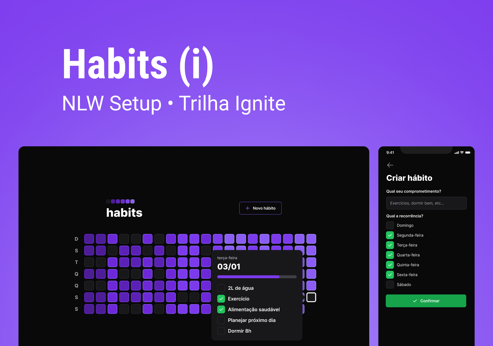
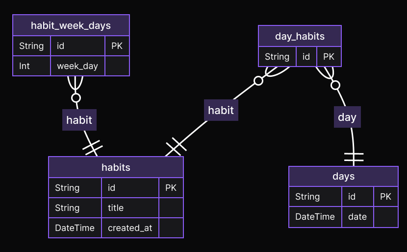
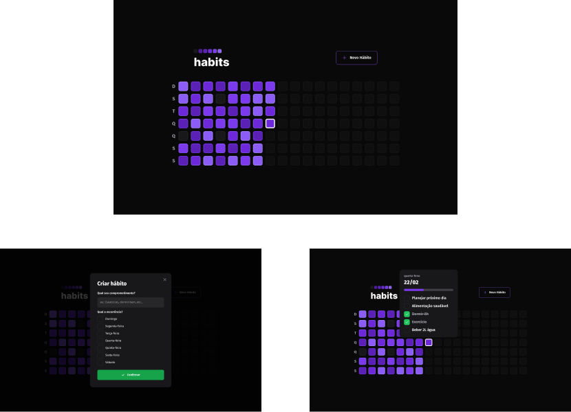

<h1 align="center">
  
</h1>

 

<strong>habits</strong> é um aplicativo para ajudar a gerenciar suas tarefas diárias

 

  <a href="#server">Server</a>
  &nbsp;&nbsp;&nbsp; | &nbsp;&nbsp;&nbsp;
  <a href="#web">Web</a>
  &nbsp;&nbsp;&nbsp; | &nbsp;&nbsp;&nbsp;
  <a href="#mobile">Mobile</a>

 

  

 
 
 

## Server
  
### ⌨️ Tecnologias
- [JavaScript](https://www.javascript.com)
- [TypeScript](https://www.typescriptlang.org)
- [Fastify](https://www.fastify.io)
- [Prisma](https://www.prisma.io)
- [SQLite](https://www.sqlite.org)
  
### 🖼️ ERD (Entity Relationship Diagram)
  

 

## Web

### ⌨️ Tecnologias
- [JavaScript](https://www.javascript.com)
- [TypeScript](https://www.typescriptlang.org)
- [ReactJS](https://reactjs.org)
- [Vite](https://vitejs.dev)
- [Tailwind CSS](https://tailwindcss.com)
  
### 🖼️ Layout

 

## Mobile

### ⌨️ Tecnologias
- [JavaScript](https://www.javascript.com)
- [TypeScript](https://www.typescriptlang.org)
- [React Native](https://reactnative.dev)
- [Expo](https://expo.dev)
- [NativeWind](https://www.nativewind.dev)
  
### 🖼️ Layout

